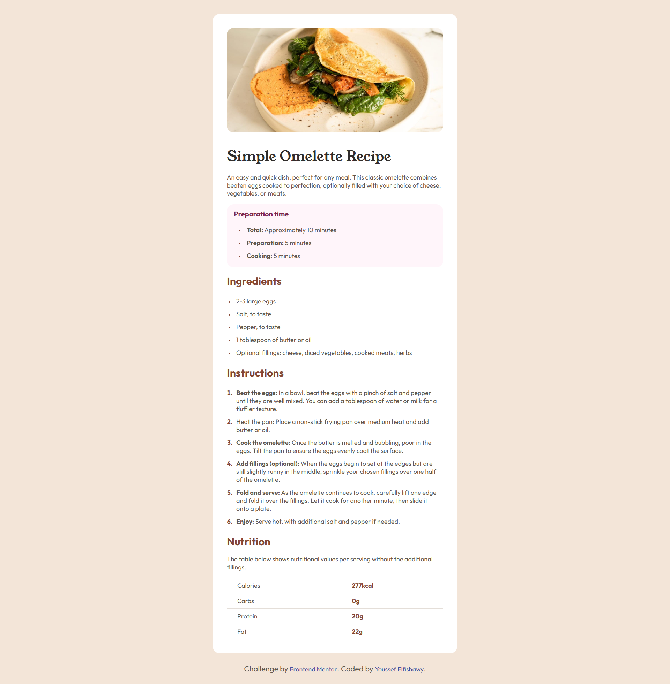
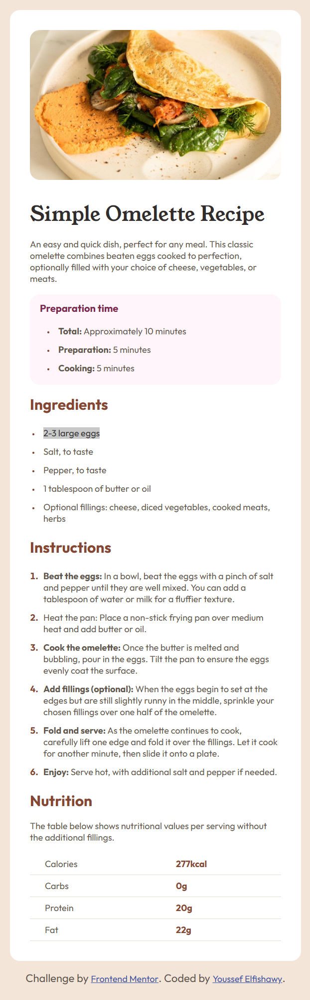

# Frontend Mentor - Recipe page

This is a solution to the [Recipe page challenge on Frontend Mentor](https://www.frontendmentor.io/challenges/recipe-page-KiTsR8QQKm). Frontend Mentor challenges help you improve your coding skills by building realistic projects.


## Table of contents

- [Overview](#overview)
  - [The challenge](#the-challenge)
  - [Screenshot](#screenshot)
  - [Links](#links)
- [My process](#my-process)
  - [Built with](#built-with)
  - [What I learned](#what-i-learned)
  - [Continued development](#continued-development)
  - [Useful resources](#useful-resources)
- [Author](#author)

## Overview

### The challenge

Users should be able to:

- View the recipe page with proper typography and layout
- See hover states for interactive elements
- Experience a responsive design that works on both desktop and mobile devices

### Screenshot




### Links

- Solution URL: [Add solution URL here](https://your-solution-url.com)
- Live Site URL: [Add live site URL here](https://your-live-site-url.com)

## My process

### Built with

- Semantic HTML5 markup
- CSS custom properties (CSS variables)
- Flexbox for layout
- Mobile-first workflow
- Google Fonts (Outfit and Young Serif)
- Custom CSS styling with hover effects

### What I learned

This project helped me practice creating a clean, readable recipe page layout. Key learnings include:

1. **Typography hierarchy**: Using different font families (Young Serif for headings, Outfit for body text) to create visual hierarchy
2. **CSS Custom Properties**: Implementing a color system using CSS variables for consistent theming
3. **Responsive design**: Creating a layout that works well on both desktop and mobile devices
4. **Table styling**: Formatting nutritional information in an accessible table format

```css
:root {
  --white: hsl(0, 0%, 100%);
  --stone-100: hsl(30, 54%, 90%);
  --stone-150: hsl(30, 18%, 87%);
  --stone-600: hsl(30, 10%, 34%);
  --stone-900: hsl(24, 5%, 18%);
  --brown-800: hsl(14, 45%, 36%);
  --rose-800: hsl(332, 51%, 32%);
  --rose-50: hsl(330, 100%, 98%);
}
```

```html
<div class="bg-purple circle">
  <div class="head">Preparation time</div>
  <ul>
    <li><span class="title">Total:</span> Approximately 10 minutes</li>
    <li><span class="title">Preparation:</span> 5 minutes</li>
    <li><span class="title">Cooking:</span> 5 minutes</li>
  </ul>
</div>
```

### Continued development

Areas I want to continue focusing on in future projects:

- Advanced CSS Grid layouts for more complex recipe card designs
- Accessibility improvements (ARIA labels, keyboard navigation)
- Performance optimization for image loading
- Advanced hover and transition effects

### Useful resources

- [Google Fonts](https://fonts.google.com/) - Used for importing Outfit and Young Serif font families
- [CSS Custom Properties Guide](https://developer.mozilla.org/en-US/docs/Web/CSS/Using_CSS_custom_properties) - Helped me implement a consistent color system
- [Flexbox Guide](https://css-tricks.com/snippets/css/a-guide-to-flexbox/) - Essential for creating the responsive layout
- [Frontend Mentor](https://www.frontendmentor.io/) - Excellent platform for practicing real-world coding challenges

## Author

- LinkedIn - [Youssef Elfishawy](https://www.linkedin.com/in/youssef-elfishawy-4102241bb/)
- Frontend Mentor - [@youssefsafwat234](https://www.frontendmentor.io/profile/youssefsafwat234)

## Acknowledgments

Challenge by [Frontend Mentor](https://www.frontendmentor.io). This project helped me practice HTML and CSS fundamentals, particularly working with CSS custom properties and Flexbox layouts.
